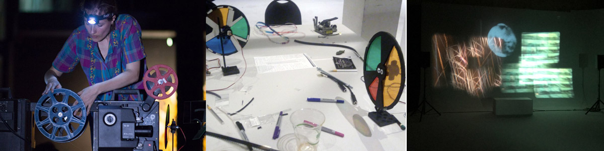
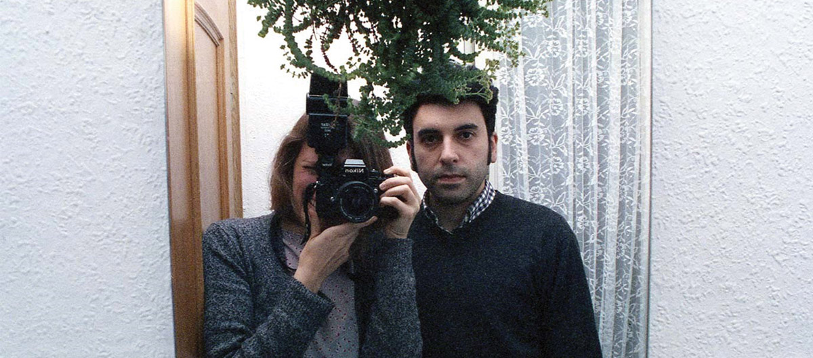

# By Other Means For Other Ends
### a project with Ojoboca, Anja Dornieden & Juan David González Monroy
#### 16 – 18 nov, 10:00 – 17:00, Studio Photography + Darkroom

In the early days of cinema projecting a film was an act of performance and as much a part of the experience as the images on the screen. Over time the act of projection was relegated to the darkness of the projection booth, but its potential persisted for filmmakers interested in finding other types of cinematic experiences. They moved the projector back into the space and began to play with the possibilities of live manipulation, creating events that expanded and exploded the constraints of the traditional cinema.

In this workshop we will explore analog techniques for exploring the possibilities of the frame, the shutter and the screen. We’ll begin by looking at the projector not as a passive device for the reproduction of coupled images and sounds but as a playable instrument. We will explore ways of transforming the quality of the light through the use of an external shutter.

In the darkroom we will go over techniques for creating images that lend themselves to live performance. Using black and white print stock we’ll apply contact printing techniques to make loops of various lengths. We’ll make photograms by placing diverse materials directly on the filmstock or copy found or original footage.

Then we’ll examine methods for incorporating sound into live performance. We’ll look at how optical sound can be manipulated using external effect gear such as effects pedals and synthesizers. To further interact with the mechanical properties of the machine, we will build contact microphones to manipulate sound through touch.

Finally, the participants, individually or in groups, will use the material created in the workshop to produce and perform a short piece of expanded cinema with single or multiple projectors and live sound.

Anja Dornieden and Juan David González Monroy are filmmakers based in Berlin. They work together under the moniker OJOBOCA. Together they practice Orrorism, a simulated method of inner and outer transformation. They have presented their films and performances in a wide variety of venues and festivals worldwide, among them the Wexner Center for the Arts, Museum of the Moving Image, Österreichische Filmmuseum, Anthology Film Archives, Haus der Kulturen der Welt, Kunstverein München, Ullens Center for Contemporary Art, International Film Festival Rotterdam, Berlinale, New York Film Festival, Visions du Réel, RIDM, Ann Arbor Film Festival and Edinburgh International Film Festival. Both González Monroy and Dornieden are members of the artist-run film lab LaborBerlin.

*An initiative of Media Arts and Film in collaboration with KASKcinema.*
