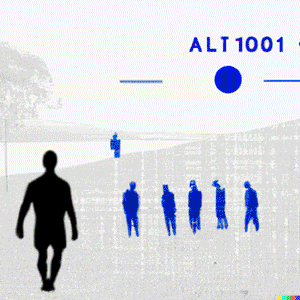
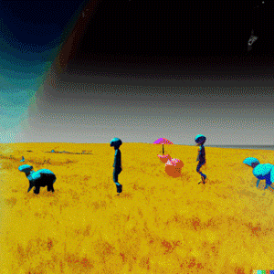
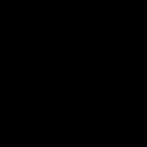

# PATTERN BEHAVIOR
#### masterclass: een terreinverkenning in A.I.
#### atelier MEDIAKUNST & FILMstudio 
#### 23 & 24/03/23 10:00 - 17:00

Tijdens deze tweedaagse masterclass wordt het snel oprukkende fenomeen van Artificiële Intelligentie vanuit diverse invalshoeken en disciplines verkend. Elk dagdeel wordt er door een verschillende docent of gast een bepaalde casus of context aangereikt waar dan dieper wordt op ingegaan.    
Het wordt dus eerder een reflexieve dan praktische workshop, maar actieve participatie blijft niettemin essentieel. Deelname is daarom beperkt tot maximum 15 studenten.

    
generated by DALL·E on 2023-02-23 prompt:a field exploration in Artificial Intelligence

#### Donderdag 23 mrt 10:00 - 16:00 @ Atelier Mediakunst
Docent Raf Schoenmaekers (animatiefilm) licht A.I. toe als een mathematische constructie en licht belangrijkste ideeën toe achter machine learning, neurale netwerken en deep learning. Met als casus het masterproject van Loes Vanneste.     

Masterstudent Floor Toppets (Mediakunst) ‘traint’ haar video-archief met het AI programma Stable Diffusion, wat ‘nieuwe’ herinneringen oplevert.     

#### Vrijdag 24 mrt 10:00 - 16:00 @ FILMstudio
[Various Artists](http://various-artists.be) (expo van 1 april in KIOSK) gidst ons van A.I. tot Z.I. (met tussenin bvb ook U.I.= Universele Intelligentie) ahv verschillende toepassingen uit zijn eigen oeuvre.    

Docent Pieter Blomme (Digital Storytelling) illustreert generatieve beeldcreatie ahv het RunwayML project en daagt daarna uit een working proof of concept te maken.    

Stuur een email naar Robbe Vervaeke en/of Jerry Galle om je in te schrijven.    
De masterclass kan plaatsvinden in het Nederlands of Engels, afhankelijk van de deelnemers.

In samenwerking met animatiefilm & digital storytelling.
