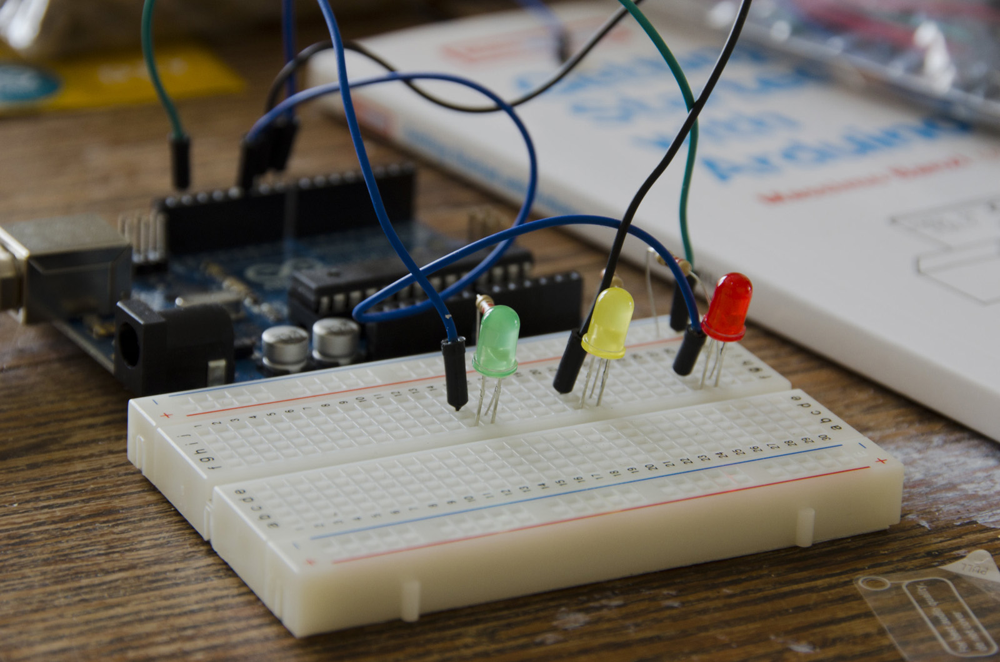

# Physical Computing ¢σ∂єℓαв
#### dinsdag, 21 & 28 feb. 2023, 9:00 - 12:30

Physical computing verwijst naar het gebruik van computertechnologie in interactie met de fysieke wereld op manieren die verder gaan dan de traditionele in- en uitvoerapparaten, zoals muizen, toetsenborden en schermen. Door gebruik te maken van sensoren en actuatoren kunnen we gegevens uit de omgeving (temperauur, licht, beweging, aanraking, ...) meten en koppelen aan apparaten als motoren, lampen, etc.     
We gebruiken hiervoor het populaire platform [Arduino](https://www.arduino.cc) dat bestaat uit een microcontroller-board & software.     

## DEELNEMEN
De workshop is gericht op beginners, er is geen voorkennis van elektronica of programmeren vereist.    

Je kan je aanmelden door je in te schrijven via [dit document](https://hogent-my.sharepoint.com/:x:/g/personal/hendrik_leper_hogent_be/ER2_JibzTiNOpsHXtF00P1wBMcugSlegwFgL0WCUqkua7Q?e=NIhvBn). De workshop duurt 2 halve dagen maar je kan ook enkel deelnemen aan de eerste dag.   

Breng je eigen laptop mee met de [Arduino (IDE2)](https://www.arduino.cc/en/software) geïnstalleerd.    

## TUTORIAL
[Arduino Tutorial op github](https://github.com/theBlackBoxSociety/CodeCrashCourses/blob/master/ArduinoTutorial.md)
