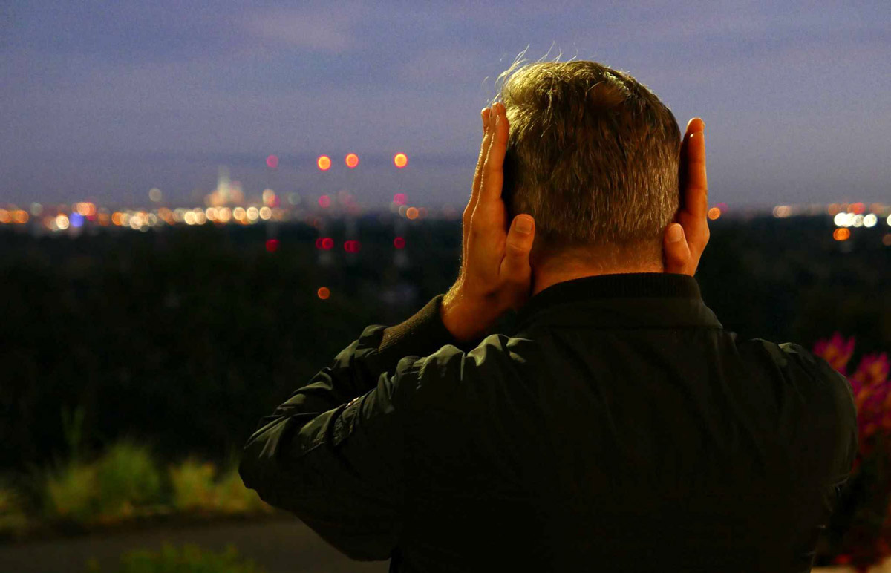

# POETIC ECHOLOCATION   
#### workshop in situ composing with David Helbich
#### 21/03/2023 10:00 - 17:00 & 22/03/2023 12:00 - 20:00
#### ARSENAALSITE Gentbrugge

Hoe neemt het oor de ruimte om ons heen waar? Hoe worden gebouwen tot zingen gebracht?    

We trekken ons twee dagen terug uit de veilige context van het atelier, de studio’s en repetitieruimtes om een compositie te maken met gevonden materialen in de brute maar resonerende architectuur van een gebouwencomplex met een industrieel verleden.     

    
©️ Stephen Douglass

Op de Arsenaalsite zal onder begeleiding van de klankkunstenaar David Helbich en docenten van de afdelingen compositie (scheppende muziek, conservatorium) en mediakunst (beeldende kunsten, KASK) een workshop locatie-specifieke compositie worden gegeven. Gezamenlijk worden ter plaatse eerst ad hoc klanken en instrumenten gevonden en in het vervolg een compositie ontwikkeld, die met eenvoudige middelen de ruimte bespeelt. Enig elektronisch en akoestisch materiaal wordt ter beschikking gesteld, waar als groep mee gewerkt kan worden. De interactie van klank en beweging in verhouding tot de ruimte staat centraal in deze workshop.     

Het geheel speelt zich af over twee dagen. De workshop start met een inleiding, oefeningen en experimenten. Hierna volgt tijd om individueel of in groep werk te ontwikkelen. De workshop wordt afgesloten met een publieke presentatie.    

[David Helbich](http://davidhelbich.blogspot.com) studeerde compositie en filosofie in Amsterdam en Freiburg. Sinds 2002 woont en werkt hij in Brussel. Hij creëert verschillende experimentele werken voor podium, papier, internet en de openbare ruimte. Zijn traject beweegt zich tussen representatieve en interactieve werken, stukken en interventies, tussen conceptueel werk en acties. Een terugkerende interesse in zijn oeuvre is het begrip van een publiek als actieve individuen en de zoektocht naar een opening van ervaringen in een artistiek beperkte ruimte.   

Er zijn 20 plaatsen beschikbaar. Stuur een email naar jesse.broekman@hogent.be en/of  hendrik.leper@hogent.be indien je wil participeren.

Een samenwerking tussen Compositie en Mediakunst in het kader van [It’s About Time...!](https://nomadic.schoolofartsgent.be/en/portfolio/its-about-time-werktitel/)  de interdisciplinaire projectweek georganiseerd vanuit Nomadic School of Arts.