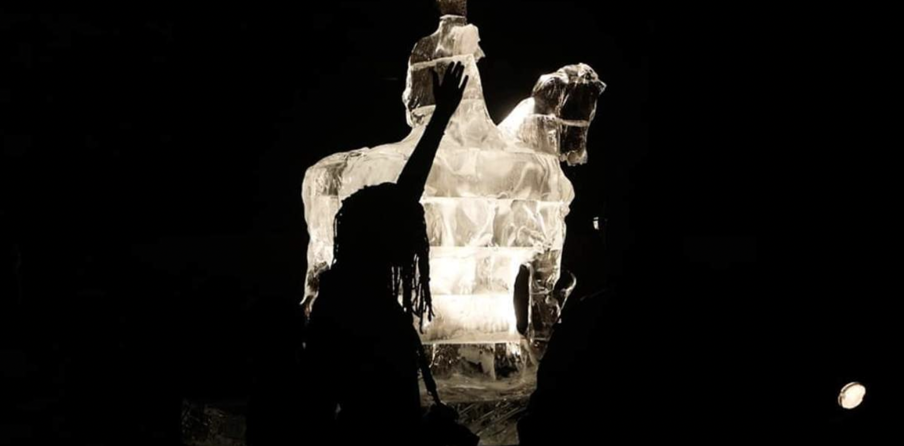

# Radical Presence
###  a project by Laura Nsengiyumva with Johanna Couvée & Brenda Odimba
#### 16/11/2022 9:30 - 17:00 Mediakunst Studio

In a world in transition to a post-colonial society, artists have an important role in reimagining new ways to relate to each other. Social struggles like ecology or queerness have already made their way into the art school, while addressing colonial history and its racial outcomes still seems to be disruptive to an apolitical conception of art. Nevertherless, the future is now and we cannot condemn yet another generation to ignorance.

This introduction to **#ARTIVISM** wishes to expand your practice beyond the western canon of “art”, to a place where community work, memory, and design are the colors on your palette. Those three eclectic days are composed for you to never get comfortable, but rather to learn actively and responsibly what this **#DECOLONIZATION** is about!

## prt1/ DECOLONIZING MYSELF
Let’s talk about race! This workshop is aimed to the ones willing to understand “whiteness” in its theoretic and emotional dimension.
In order to create a safer space for everyone, this workshop will be at some point split into two groups. Only reserved for students perceived as white. The point is to free you from the political correctness pressure, to not be afraid to make mistakes and truly explore.

### program
9:30 > 11:00    
BOOKCLUB    
11:00 > 12:00    
DECOLONIAL ART (lecture)
learning colonial history through art - Laura Nsengiyumva    
13:00 > 17:00    
DECONSTRUCT WHITENESS - Johanna Couvée    
or    
SURVIVING WHITENESS - Brenda Odimba    
➻ get the full program [here](projectDAY_Radical_Presence.pdf)

## SUBSCRIBE !!!
➻ [here](https://docs.google.com/spreadsheets/d/1f1ez6e2XBeex0dcNazkk8_9nLM9WcyvdRVv2u4tOL_Q/edit?target=_blank)

*This project will be followed up during the 2nd project week.*
