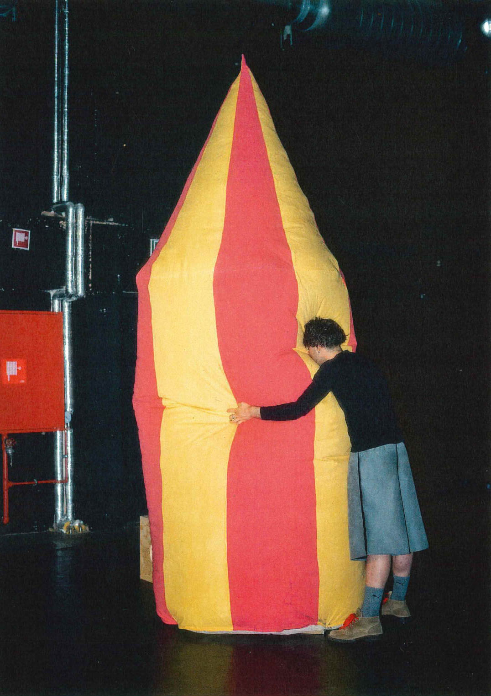

# In Conversation with Seppe Claerbout: Art, Identity, and the Aftermath of Art School
#### Wednesday, 18 February, 14:00
#### Black Box Atelier Mediakunst

===

[Seppe Claerbout](https://www.seppeclaerbout.be/) is a visual artist based in Ghent working at the intersection of installation and performance. His work seeks to craft new narratives, rooted in personal experience yet transcending oppressive forces from society. Through the concept of queer splendor, he tries to reclaim aesthetic abundance in attempt to reflect identity and build community.    
 
In this presentation, Seppe will focus on his own trajectory at KASK, sharing how he navigated the institution and how his work evolved within the Media Art studio. Focusing on the performative element of his work, he will present parts of his portfolio and address a crucial question: how do you deal with the world outside and after the school?    

Afterward, Seppe invites the students to join a conversation about their own experiences with the school, teachers and the performative nature of being a student.    

Through the semester, Seppe will teach some classes and will be available for feedback sessions for all the bachelor students of Mediakunst.    

