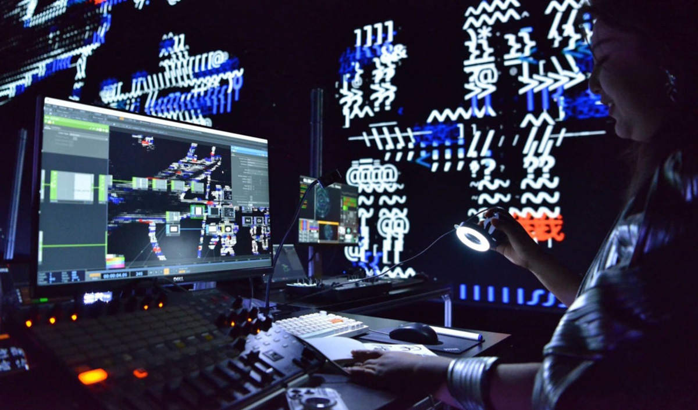

#  TouchDesigner
#### workshop met Gertjan Biasino
#### woe. 5 & 19 februari 2025 9:30 – 12:30

[TouchDesigner](https://derivative.ca/showcase) is een visuele programmeeromgeving waarmee je real-time interactieve media en audiovisuele installaties kunt creëren. Het behoort tot de wereld van Creative Coding, waarin programmeren toegankelijk wordt voor kunstenaars en ontwerpers zonder formele programmeerkennis. Een veelgebruikte methode hierin is visueel programmeren, waarbij processen grafisch worden weergegeven in plaats van via tekstcode.    

TouchDesigner maakt het mogelijk om digitale media op flexibele wijze met elkaar te verbinden: alles wat gedigitaliseerd kan worden, kan als input dienen, en alles wat digitaal aangestuurd kan worden, kan een output zijn. Dit biedt de mogelijkheid om op maat gemaakte toepassingen te ontwikkelen die veel standaard creatieve tools, zoals de Adobe-suite, niet kunnen realiseren.    

De software wordt vaak ingezet voor projecten zoals live visuals (bijvoorbeeld [unitxt](https://www.youtube.com/watch?v=EJG0ETkoLCM) van Alva Noto), interactieve kunstwerken zoals Leviathan’s [150 Media Stream](https://www.lvthn.com/work/150-media-stream-installation), generatieve animaties, datavisualisaties en projectie mapping (zoals [Horta](https://vimeo.com/120249879) van [studio Théoriz](https://www.theoriz.com/), gemaakt voor het Ghent Light Festival 2015).    

TouchDesigner combineert creatieve vrijheid met krachtige tools voor het manipuleren van beeld, geluid en data. De software wordt ontwikkeld door het in Toronto gevestigde bedrijf [Derivative](https://derivative.ca/).    
    

    
Hill Jiang (TEA Community) performing at FLARE Festival 2023

    
🫣 **Wat is TouchDesigner nu?**     
Bekijk misschien [deze video](https://www.youtube.com/watch?v=Y0xZzuYS2YI) 🍿 & blader even rond op [deze website](https://derivative.ca/showcase)    

**Wil je graag deelnemen?**    
Dat kan als je een min of meer recente laptop hebt, [TouchDesigner installeert](https://derivative.ca/download) (free version) en activeert (op voorhand!!) en je inschrijft.    

Optioneel open leermoment met Yagho Moonen op woe. 12/02 9:30-12:30     

**Gertjan Biasino** is een kunstenaar die voortdurend op zoek is naar synergie tussen diverse media. Hij is gespecialiseerd in real-time video-installaties, waarbij hij bewegende objecten en interactieve elementen combineert. Zijn werk onderzoekt thema's zoals het menselijk lichaam in de kunst, nieuwe visuele objecten, het onzichtbare binnen time-based kunst, en de rol van reactiviteit en interactiviteit in mediakunst. Daarnaast is hij een ervaren maker en workshopbegeleider, waarbij de nadruk ligt op het proces van creëren en doen.
