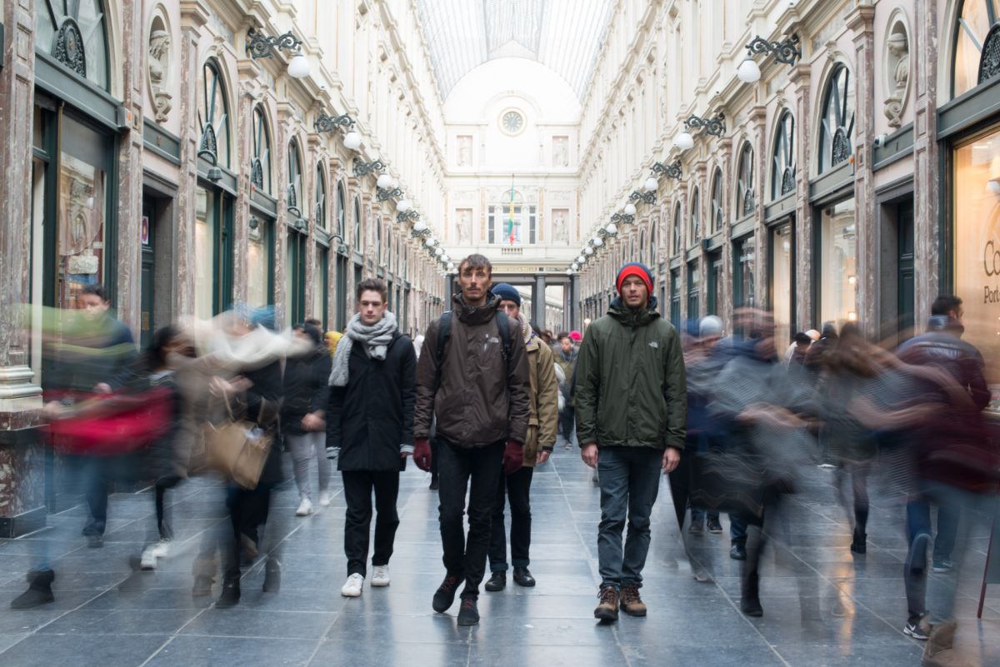

# TWO WALKS

Dit jaar start het tweede semester met een lesvrije week waarvan de invulling door de studenten wordt bepaald. Na verzoeken rond groepsdynamiek en welbevinden hebben we geen spirituele retraite, maar wel twee bijzondere wandelingen gepland. Schrijf je in via e-mail bij Anouk, die beide dagen zal begeleiden. Capaciteit is beperkt, dus wees er snel bij!

    

## Walk Piece met David Bergé 
#### Woensdag 24.01 10:30 > 15:00
#### KASK Atelier Mediakunst + stadscentrum
 
In het werk van [David Bergé](https://davidberge.info/) (hij/hem) neemt het publiek via hybride en postdigitale vormen deel aan een reis van lecture performances, installaties en boekprojecten. Het meest bekend is hij echter om zijn Walk Pieces waarin hij kleine groepen in stilte door het weefsel en de infrastructuur van een stad leidt.    

David zal 's ochtends zijn werk introduceren en je 's middags meenemen op een wandeling.

## Slow Walk met Julia Rubies
#### Vrijdag 26.01 14:00 > 16:00
#### Brussel (exact location TBC)

A Slow Walk benadrukt de hectiek en het hoge tempo van de stad door bewust de snelheid te vertragen waarmee we van de ene plek naar de andere reizen. Het is een meditatie en een uitnodiging om je lichaam en geest te vertragen en de stad en haar inwoners vanuit een nieuw perspectief te ervaren. Het is een manier om stil te staan en na te denken over de stad en een poging om de stad weer deel van ons te maken door middel van de meest basale vorm van beweging die denkbaar is: wandelen.    

[Julia Rubies](https://jurusu.cargo.site) (zij/haar), afgestudeerd aan P.A.R.T.S., is een danseres, medewerkster en maker in de podiumkunsten uit Barcelona, woonachtig tussen Barcelona en Brussel. Ze is geïnteresseerd in het beoefenen van uitgebreide choreografische benaderingen als ruimtes van transformatie.

