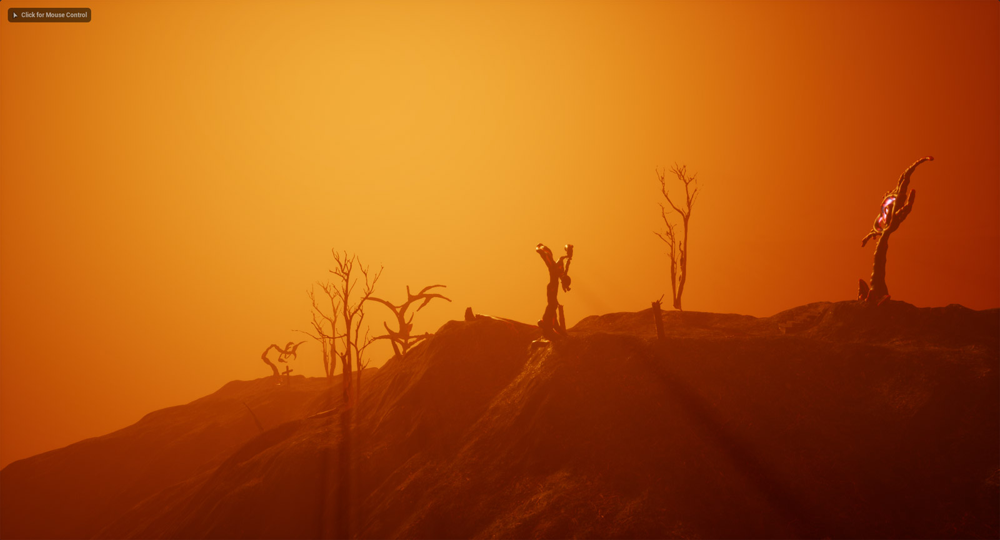

# Unreal Engine ¢σ∂єℓαв
### Inleiding tot 3D-World building met Unreal Engine
#### woensdag ~~1 &~~ 8 & 15 mrt 2023, 15:00 - 18:00
> Unreal Engine is the world’s most open and advanced real-time 3D creation tool. Continuously evolving to serve not only its original purpose as a state-of-the-art game engine, today it gives creators across industries the freedom and control to deliver cutting-edge content, interactive experiences, and immersive virtual worlds.

Tijdens deze praktijkgerichte workshop zal Quinten Vanagt je leren hoe je interactieve 3D werelden kunt uitbouwen. Aan de hand van concrete voorbeelden zul je leren hoe je een level uitbouwt, assets correct importeert met textures en hoe belichting in Unreal Engine werkt. Tegen het einde van de workshop is het de bedoeling dat je al deze stappen zelf kunt uitvoeren en een basiskennis van de interface en toepassingen hebt.    

Indien je al ervaring hebt met Unreal Engine is er ook ruimte om aan complexere dingen te werken of meer te focussen op de film/animatie productiemogelijkheden binnen UE5.​​

## DEELNEMEN
Inschrijven via [dit document](https://hogent-my.sharepoint.com/:x:/g/personal/hendrik_leper_hogent_be/ER2_JibzTiNOpsHXtF00P1wBMcugSlegwFgL0WCUqkua7Q?e=NIhvBn) 

De deelnemers zorgen zelf voor een **recente laptop** met [Unreal Engine](https://www.unrealengine.com/en-US/download?install=true) reeds geïnstalleerd + een muis met 3 fysieke knoppen!!! Het is erg belangrijk dat je **op voorhand** test of de software werkt zodat er niet nodeloos tijd verloren moet worden. Indien installatie niet verloopt zoals verhoopt kan je met ons contact opnemen. Controlleer [hier de optimale en minumum specs](https://docs.unrealengine.com/4.27/en-US/Basics/InstallingUnrealEngine/RecommendedSpecifications/) voor je computer.

---
## QUINTEN VANAGT
Quinten Vanagt is een oud student mediakunst. Momenteel is hij bezig met zijn master vrije kunsten af te ronden op KASK. 2 jaar geleden werkte hij mee aan het “school of arts world” project. Dit project had als doel een game versie van KASK te ontwikkelen waar studenten elkaar online in konden ontmoeten tijdens de coronapandemie. Vorig jaar maakte hij een animatie kort film in Unreal Engine die geselecteerd werd voor het ‘Junkdump magazine film festival 2022’ in New York. Voor zijn eigen praktijk is hij ook bezig met het bouwen van de game “AUTOMATED ME” die de speler op een interactieve manier wilt leren over privacy en social media algoritmes in een dystopische open world omgeving.
