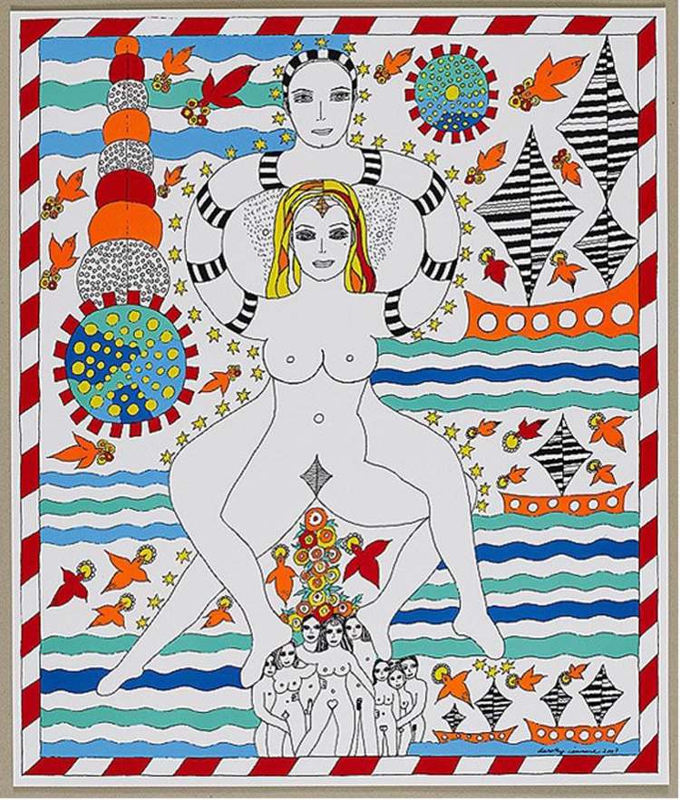
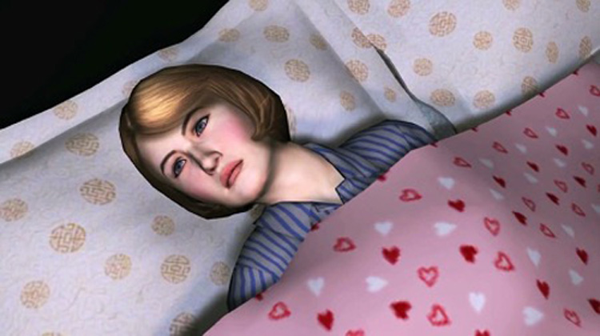
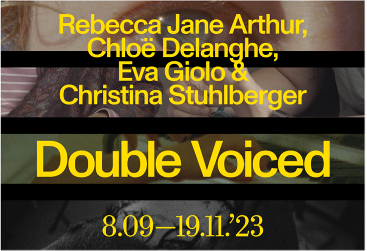

# BEZOEK M HKA, HET BOS & Kunsthal Extra City
**donderdag 16 november**

### M HKA - Dorothy Iannone

De tentoonstelling Love Is Forever, Isn't It? is een van de meest uitgebreide overzichtstentoonstellingen van het omvangrijke oeuvre van Dorothy Iannone in het M HKA.    
Dorothy Iannone (1933-2022) was een in Berlijn gevestigde Amerikaanse beeldende kunstenaar. Haar artistieke praktijk omvatte schilderijen, kunstenaarsboeken, video-installaties, sculpturen, tekeningen en geluidswerken. In haar beeldende en geschreven oeuvre creëerde ze een unieke relatie tussen tekst, beeld, geluid en sculpturale objecten, met een bijzondere nadruk op hun narratieve en fictionele dimensies.    
Het voornaamste aandachtspunt van dit project is de hercontextualisering van Iannone's werk, waarbij specifiek de intrinsieke performatieve aard, die tot nu toe nauwelijks is onderzocht, wordt belicht. De tentoonstelling verkent romanconventies, verhaallijnen, relaties tussen woorden en beelden en auto-fictionele en biografische elementen in haar creaties.    

[More/Meer info](https://antwerpart.be/agenda/dorothy-iannone-love-is-forever-isn-t-it)

### VISITE FESTIVAL - Peggy Ahwesh

Visite gaat helemaal los tijdens de 11e editie van het festival door de beroemde Amerikaanse videokunstenaar Peggy Ahwesh uit te nodigen. In de jaren 80 begon ze haar carrière met het maken van feministische punk- en amateur super 8-films. Ze staat bekend om haar gebruik van een breed scala aan verschillende technologieën, methoden en esthetieken en haar werk is uitgebreid vertoond in Centre Pompidou, MOMA, Guggenheim, Whitney Museum of American Art, Anthology Film Archives, New York Film Festival en nu ook in Het Bos in Antwerpen.

[More/Meer info](https://visitefestival.be/Live-Radio-QUEER-TRANSMISSIONS-BY-STRANGELOVE)

### EXTRA CITY - Elephy

Double Voiced brengt het audiovisueel werk van vier kunstenaars samen in een gedeelde scenografie. Centraal in hun werk staat de observatie van mensen, plaatsen en gewoonten. De tentoonstelling bevraagt hoe zelfbeelden en identiteit worden uitgevoerd en geconstrueerd, en kijkt naar de alledaagse gewoonten en objecten die deze beelden definiëren. Ze betreedt zowel de huiselijke ruimte als landschappen, luistert naar de menselijke stem en de natuur en koestert vrouwelijke rolmodellen. De werken van de kunstenaars vormen samen een collectief patchwork van stemmen. Elke protagonist wordt hierdoor afzonderlijk versterkt en sociaal en politiek geactiveerd.

[More/Meer info](https://extracitykunsthal.org/en/exhibitions/double-voiced)

