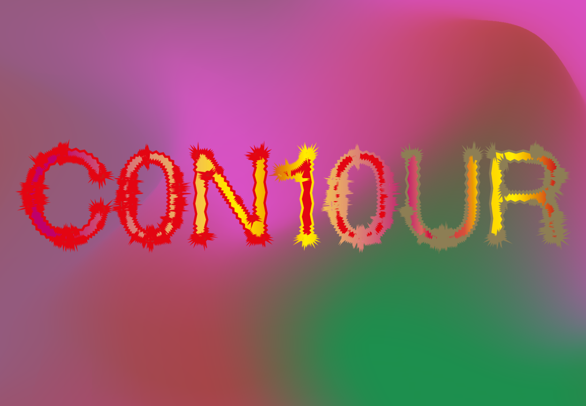

# BEZOEK C0N10UR in Mechelen 📽️

We nemen jullie graag mee naar C0N10UR, de Biënnale voor Bewegend Beeld in Mechelen. Er zijn 3 locaties en een mooie line-up van kunstenaars!    

>WE ARE ROOTED BUT WE FLOW
 
Van 9 september tot 5 november 2023 vindt de tiende editie van de Contour Biennale voor Bewegend Beeld plaats. Open je ogen én oren, en duik mee onder in uiteenlopende vormen en formaten van bewegend beeld, exclusieve filmpremières en live events op maat van het programma.    

C0N10UR brengt werk bij elkaar van in België verblijvende kunstenaars en wil hun werk tonen in de meest ideale omstandigheden. Deze editie, de eerste samengesteld door kunstenaars (Anouk De Clercq, Fairuz Ghammam, Herman Asselberghs, Manon de Boer en Sven Augustijnen van Auguste Orts), verenigt generaties en stijlen en geeft zo een uitstekend beeld van de diversiteit binnen het hedendaagse Artists' Moving Image.    

Het volledige programma vinden jullie [hier](https://www.nona.be/nl/contour-biennale).
 
