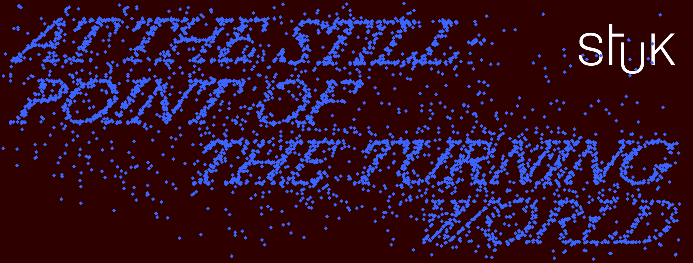

# ARTEFACT FESTIVAL 2024 (Leuven) 🧭

Op woensdag 21 februari nodigt KASK Mediakunst jullie uit om samen mee te dwalen door [Artefact 2024](https://www.artefact-festival.be/nl) in Leuven, op zoek naar banden en inspiratie in het werk van kunstenaars Saodat Ismailova, Pei-Hsuan Wang, Germaine Kruip, Hyun-Sook Song, Mickey Yang, Sky Hopinka, Felipe Baeza, Sophie Whettnall, Beatrice Gibson, Etel Adnan, Alfredo Jaar, Liliane Lijn, Anne Duk Hee Jordan, Arpaïs Du Bois, Margaret Salmon en onze eigen Anouk De Clercq.✨

> Onder de titel "At the still point of the turning world" zoeken de kunstenaars in Artefact 2024 naar troost, kracht en betekenis. In een groter kosmisch geheel, in (familie)banden over generaties heen, in de relatie tussen vormen en materialen, en in poëzie. Kom langs en laat je meevoeren naar het oog van onze stormende wereld.    
> - Karen Verschooren & Zeynep Kubat, curatoren van At the still point of the turning world, artefact 2024.

We ontmoeten elkaar bij STUK om 14u (open van 14u tot 22u) en krijgen een introductie van curator Karen Verschooren en een rondleiding van hun warme en gastvrije medewerkers van de publieksprogramma's - lucky us! Je moet je eigen (trein-)reis regelen, maar de tentoonstelling is gratis en de rondleidingen zijn een cadeautje van STUK. 💝    
     
     
*Meld je [hier]( https://docs.google.com/spreadsheets/d/1z7jUymAAjz32tEzy5npYnjG-P1FsglXi4n4ImGU2lpU/edit?usp=sharing) aan voor volgende week (vóór donderdag 15 februari) zodat we je aanwezigheid bij STUK kunnen registreren.*

Adres STUK: Naamsestraat 96, 3000 Leuven, België
 
