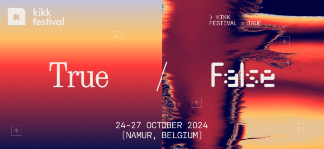

# KIKK FESTIVAL
#### Namen, 24 & 25 oktober 2024

KIKK Festival, een internationaal festival van creatieve en digitale culturen, vindt voor de 13e keer plaats in Namen van 24 tot 27 oktober 2024. Vier dagen lang komen digitale kunstenaars, bedrijven en het publiek samen om ideeën uit te wisselen, te leren en te netwerken in een feestelijke en creatieve omgeving.

Het thema dit jaar is:  
### TRUE/FALSE - GENERATIVE ARTIFICIAL INTELLIGENCE

In een tijdperk van deepfakes en generatieve AI staat de betrouwbaarheid van onze waarnemingen onder druk. We leven in een post-truth samenleving waar de grens tussen werkelijkheid en illusie vervaagt. Geavanceerde technologieën overspoelen ons met oncontroleerbare speculaties, vaak afkomstig van anonieme algoritmen.

Onze online aanwezigheid is een zorgvuldig gecreëerde representatie van de "selfie-samenleving." Sociale netwerken draaien om zelfpromotie en de zoektocht naar validatie via likes en volgers. De inhoud die we consumeren en creëren is genormaliseerd door influencers en algoritmen, wat een kloof creëert tussen onze digitale persona's en authentieke identiteiten.

Tijdens het KIKK festival verkennen we de verschillende facetten van digitale misleiding. Naast de politieke en activistische implicaties van fake news en algoritmische manipulatie, nodigt het festival uit tot reflectie op de illusies die onze zintuigen beïnvloeden. Via meeslepende installaties en prikkelende kunstwerken worden bezoekers uitgedaagd om hun waarnemingen te bevragen en de vervormbaarheid van de werkelijkheid onder ogen te zien. Het festival belooft een reis door de digitale wereld, waar waarheid en leugen samenkomen.

🧠 [Inspiring Talks](https://www.kikk.be/talks/): Woon lezingen bij van industrieleiders over de nieuwste trends in technologie, design en digitale en beeldende kunst.    
🎨 [Digital art exhibition in the city](https://www.kikk.be/exhibitions/): Ontdek 60 kunstwerken en installaties die creativiteit en technologie combineren op iconische locaties in Namen.     

## 👉🏻 Paktisch
Wij bezoeken het festival op donderdag 24 en vrijdag 25 oktober. Dat zijn 2 dagen tijdens een reguliere lesweek. Er zullen mogelijks enkele lessen gemist worden. Met de praktijkdocenten wordt een leswissel afgesproken (indien nodig).    

Prijs voor een studenten ticket 35€ (betaald via het ateliergeld)    
Voor docenten is de toegangspas 89€.    

Er is slaapplaats gereserveerd voor ±15 personen op de boot ‘[La Valse Lente](https://lavalselente.com/)’.    
Voor 12 personen zijn er bedden, er kunnen een 3tal extra personen mee als ze een matje en slaapzak voorzien.    

Kostprijs per persoon 40€. KASK schier voor vordert 40€ per deelnemers terug via factuur.    
 
Heen- en terugreis gebeurt met de trein. Ook dit wordt door deelnemers zelf betaald (aan 2x6€ met een Youth Multi pass). Uren nog te bepalen.    
 
Voor alle eten (ook ontbijt) staan deelnemers zelf in. Ik vermoed dat je hiervoor best ±40 rekent.    

Inschrijven kan per mail naar Hendrik Leper!    
First come, first served.

